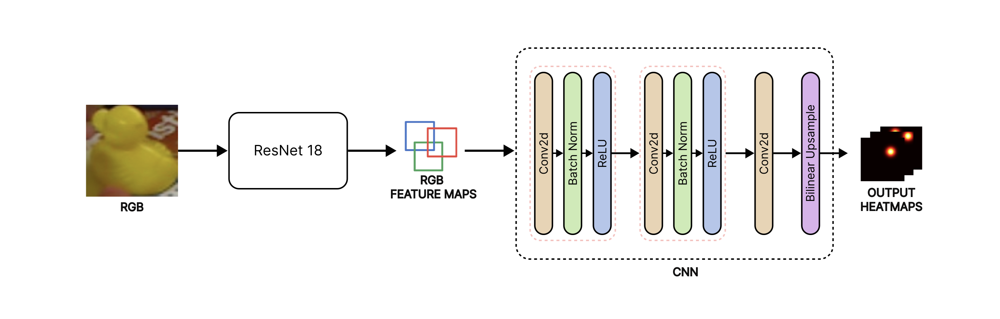
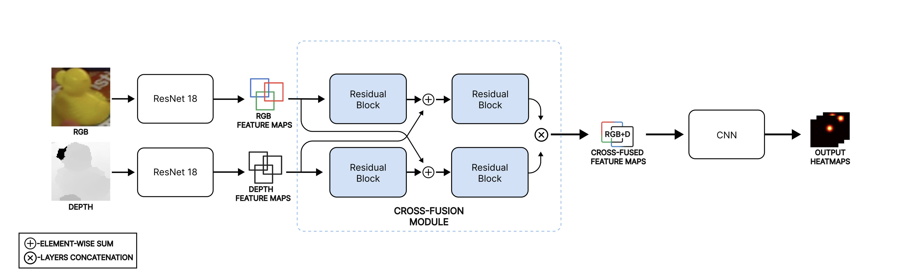

# 6D Pose Estimation via Keypoint Heatmap Regression with RGB-D Residual Neural Networks

This repository contains the implementation of our 6D object pose estimation project on the LINEMOD dataset. The system combines object detection, keypoint heatmap regression, RGB-D feature fusion, and geometric pose recovery into one modular pipeline.

Our best configuration achieves a mean ADD-based accuracy of **92.41%** by combining:

- **YOLOv10** for object detection
- **heatmap-based keypoint regression** for 2D keypoint localization
- a **cross-fusion RGB-D residual architecture** for multimodal learning
- **PnP + RANSAC** for final 6D pose recovery

## Highlights

- Modular pipeline covering data preparation, training, prediction, and evaluation
- RGB baseline and RGB-D cross-fusion model variants
- FPS and CPS 3D keypoint sampling strategies
- ADD / ADD-S evaluation on LINEMOD
- Both notebook-based and script-based workflows are included

---

## Method Overview

The project follows a staged 6D pose estimation pipeline:

1. Prepare the LINEMOD data into a unified train/test structure.
2. Convert training annotations into YOLO format and train the detector.
3. Generate YOLO bbox predictions and use them to crop RGB and depth object patches.
4. Sample 3D object keypoints using FPS or CPS.
5. Project 3D keypoints into image space and generate Gaussian heatmaps.
6. Train a keypoint heatmap regressor:
   RGB baseline or RGB-D cross-fusion model.
7. Decode predicted 2D keypoints and solve pose with PnP + RANSAC.
8. Evaluate final pose quality with ADD / ADD-S.

## Model Architectures

The project compares a simple RGB baseline against an RGB-D extension that adds depth-aware feature fusion before heatmap prediction.

| Model | Inputs | Backbone | Fusion strategy | Output |
|---|---|---|---|---|
| Baseline | Cropped RGB patch | ResNet-18 | None | Keypoint heatmaps |
| Extension | Cropped RGB patch + cropped depth patch | Dual ResNet-18 streams | Residual cross-fusion between RGB and depth features | Keypoint heatmaps |

### Baseline RGB Heatmap Regressor

The baseline model uses a single RGB crop as input, extracts features with **ResNet-18**, and predicts one heatmap per keypoint through a lightweight convolutional upsampling head. This model is the clean reference point for measuring the benefit of depth.



### Extended RGB-D Cross-Fusion Model

The extension processes RGB and depth in parallel, builds separate feature maps, and then fuses them through a **cross-fusion residual module** before the final heatmap head. In practice, this gives the network access to both appearance cues and geometric structure, which is why it outperforms the RGB-only baseline in the project summary results.



## Repository Structure

```
.
├── data/            # datasets, labels, keypoints, projected labels, heatmaps
├── docs/            # report and related documents
├── models/          # trained checkpoints and YOLO artifacts
├── notebooks/       # original notebook workflow kept for reference
├── src/heatnet/     # reusable Python code
├── scripts/         # task-based entrypoints: prepare_data, train, predict, evaluate
├── configs/         # example JSON configs for the scripts
├── outputs/         # generated checkpoints, histories, predictions, evaluations
├── pyproject.toml   # package metadata and heatnet CLI entrypoint
├── requirements.txt # Python dependencies
└── README.md
```

---

## Getting Started

### 1. Clone the Repository

```bash
git clone https://github.com/emirmasood/HeatNet.git
cd HeatNet
```

### 2. Install Dependencies

```bash
pip install -r requirements.txt
```

### 3. Install the Local Package Entry Point

```bash
python3 -m pip install -e .
```

This enables the package-style commands:

```bash
python3 -m heatnet --help
heatnet --help
```

If editable install is blocked by your local Python setup, you can still use the package entrypoint directly from the repo root:

```bash
PYTHONPATH=src python3 -m heatnet --help
```

### 4. Download Data and Models

Due to GitHub's file size restrictions, download large files separately:

* **Dataset:** [Google Drive Data Folder](https://drive.google.com/drive/folders/1bMuIT9NpPXCQPV6SGFvr6aIEn42B3BZ-?usp=sharing)
* **ResNet Checkpoints:** [ResNet Checkpoints](https://drive.google.com/drive/folders/14pTckwpHFnaL27vCwQ3DRbv9XOCgZZOM?usp=drive_link)
* **YOLOv10m pretrained weights:** [YOLOv10m Checkpoint](https://drive.google.com/file/d/1mRdriU3u85oxcL0CPeIhJBxX795iENse/view?usp=drive_link)

Place downloaded files into their respective folders as indicated in the folder structure above.

### 5. Choose a Workflow

This repository supports two workflows:

- **Script-based workflow**
  Best for a cleaner, modular project structure.
- **Notebook-based workflow**
  Best if you want to follow the original project development phase by phase.

## Quick Start

If your assets are already prepared, the fastest way to explore the project is:

```bash
python3 -m heatnet predict --help
python3 -m heatnet evaluate --help
```

If you want to run the modular script workflow, the four main entrypoints are:

- `scripts/prepare_data.py`
- `scripts/train.py`
- `scripts/predict.py`
- `scripts/evaluate.py`

The same tasks are also available through the package entrypoint:

- `python3 -m heatnet prepare-data`
- `python3 -m heatnet train`
- `python3 -m heatnet predict`
- `python3 -m heatnet evaluate`

## Script-Based Workflow

### Prepare Data

```bash
python3 -m heatnet prepare-data --help
python3 -m heatnet prepare-data --config configs/prepare_data.example.json bbox-predict
python3 -m heatnet prepare-data --config configs/prepare_data.example.json sample-3d
```

### Train a Model

```bash
python3 -m heatnet train --help
python3 -m heatnet train --config configs/train.example.json
```

### Run Prediction

```bash
python3 -m heatnet predict --help
python3 -m heatnet predict --config configs/predict.example.json
```

### Run Evaluation

```bash
python3 -m heatnet evaluate --help
python3 -m heatnet evaluate --config configs/evaluate.example.json
```

The intended chained flow is:

1. `prepare-data` to build derived assets and YOLO bbox labels
2. `train` to fit the keypoint model
3. `predict` to export both `keypoints_2d` and final poses under `outputs/predictions/`
4. `evaluate` to read that prediction JSON and compute ADD / ADD-S metrics

## Outputs

Generated artifacts are organized under:

- `outputs/checkpoints/`
- `outputs/histories/`
- `outputs/predictions/`
- `outputs/evaluations/`

## Notebook Workflow

The notebooks are still included and useful as:

- the original project workflow
- experiment history
- visual reference for how each phase was developed

The final integrated notebook is:

```bash
jupyter lab notebooks/end_to_end/ph5_01_end_to_end.ipynb
```

The earlier notebooks remain important if you want to fully reproduce the project from raw data, retrain models, or inspect each research phase separately.

## Results

The project report and experiments compare:

- RGB baseline vs RGB-D cross-fusion models
- FPS vs CPS keypoint sampling
- multiple activation functions and scheduler variants

The best reported result in this repository is:

- **Mean ADD-based accuracy: 92.41% on LINEMOD**

### Summary Results

The table below summarizes the mean ADD-based accuracy of the RGB-D cross-fusion variants across activation functions and learning-rate schedulers.

| Scheduler | ReLU | SiLU | Mish |
|---|---:|---:|---:|
| ConstantLR | 88.19% | 82.86% | 88.32% |
| OneCycleLR | 90.14% | 91.08% | **91.92%** |
| PolynomialLR | 87.40% | 86.91% | 86.99% |

Key takeaways:

- **OneCycleLR + Mish** gives the best mean result at **91.92%**.
- Among the tested schedulers, **OneCycleLR** is consistently the strongest overall.
- **Mish** is the best-performing activation on average in this comparison.
- Relative to the **RGB baseline**, the **RGB-D cross-fusion extension** delivers the strongest overall performance in the project, showing that depth is beneficial when fused with RGB features through the residual cross-fusion design.
- The gap is not uniform across all scenes: the extension helps most in cleaner views and stronger geometric setups, while difficult occlusions remain challenging for both variants.

For the full analysis, ablations, and qualitative results, see the report in [docs](/Users/amirmasoudalmasi/HeatNet/docs).

---

## Authors
This project was created by:

Ismail Aljosevic (ismail.aljosevic@studenti.polito.it)

Amir Masoud Almasi (amirmasoud.almasi@studenti.polito.it)

Ana Parovic (ana.parovic@studenti.polito.it)

Ashkan Shafiei (ashkan.shafiei@studenti.polito.it)

## Acknowledgments
We thank Prof. Barbara Caputo, Dr. Raffaele Camoriano, Stephany Chanelo, and Paolo Rabino for their foundational instruction and guidance in the 3D learning course at Politecnico di Torino, which inspired the initial direction of this work.
